
# [first-milestone-project](https://angela64711.github.io/first-milestone-project)

Developer: Angeliki Kyratzidou ([angela64711](https://www.github.com/angela64711))

## Project Overview

This project is a responsive, mobile-first website designed for an english-speaking full spectrum doula in Berlin, named Evita Varela.
The website aims to provide clear information about services, build trust through storytelling and testimonials, and make it easy for users to get in touch.

The project was created as part of a coding sourse at Code Institute and focuses on thoughful UX decisions, accessibility, and clean front-end implementation.
It was intentionally based on a real professional, rather than a fictional person or business. Working with an existing subject allowed for a more realistic design process, including real constraints, authentic content, and meaningful user needs. Due to the nature of doula work, the project required deeper consideration of user experience, content hierarchy, and tone. This encouraged additional UX research and reflection, perticularly around accessibility, emotional safety, and mobile usability. Choosing a real-world subject supported a more practical learning experience and helped bridge the gap between theoretical knowledge and real-life front-end development and design decision making.

## Site Mockups

[techsini](https://techsini.com/multi-mockup) was used to create the mockups of the website.

### Home Page mockup

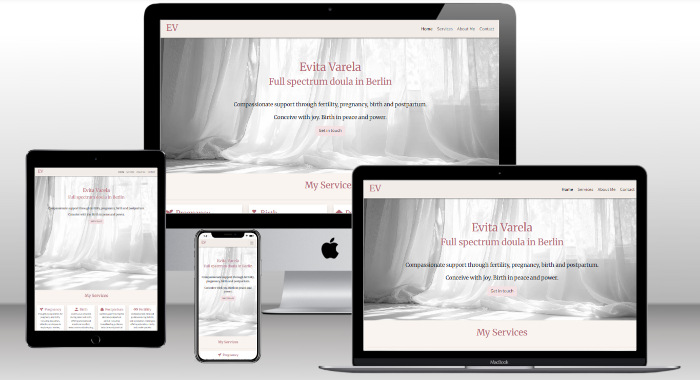

### Services Page mockup

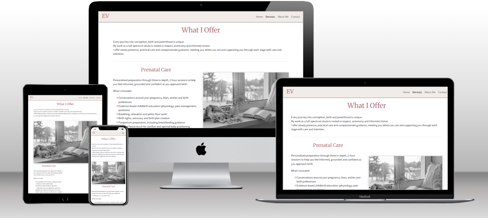

### About Me Page mockup

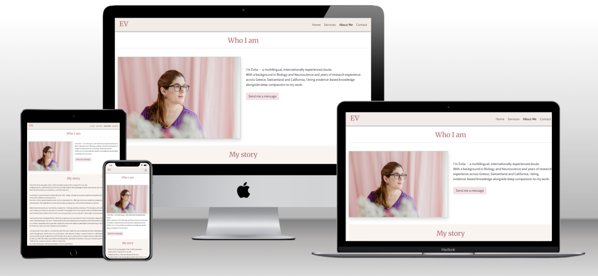

### Contact Page mockup

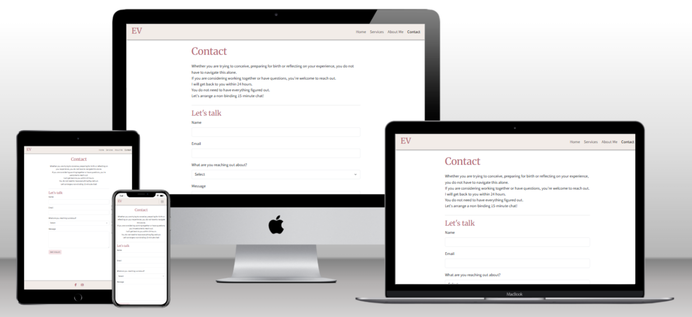

## UX

### The 5 Planes of UX

#### 1. Strategy

**Purpose**
The target audience for this website are women, who are navigating pregnancy, birth and postpartum recovery, their partners, and individuals experiencing fertility challenges who are seeking support in English in Berlin.
- Encourage users to contact the doula and inquire about her services.
- Provide a seamless user experience to keep users informed and engaged.

**Primary User Needs**
The primary goals of the target audience are:
- To find information about their needs easily
- To assess if the doula is qualified and trustworthy
- To be able to contact her easily
- To be reassured that their needs will be met in a thoughtful, warm and non-judgemental way, especially for those reaching out about their challenges
- To not feel pressured into making a decision about getting in contact
- To examine if the services povided are within their budget
- To find out what the psysichal and emotional benefits wil be

**Business Goals**

- To increase the doula's clientbase.
- To provide thoughtful and reliable information about her work, her values, her background and her credentials.

#### 2. Scope

**[Features](#features)** (see below)

**Content Requirements**
This website is a great way for the potential clients to meet their needs, because

- The information is presented clearly and calmly
- The users can easily find key information, quickly, even on mobile devices
- The visual tone of the website is emotionally suportive and trustworthy
- It provides a simple and accessible way to contact the doula
- The overall feel of the website is grounded, reassuring and calm

To meet the business goal:

- Careful and targeted decisions were made, redaring content, layout and appearence, taking into account the nature of her work and the very specific target audience
- The content was adjusted from her current website, after being reworked. The language used is less clinical and academic and more warm, caring, inclusive and sensitive, without it feeling exaggerated or fluffy
- The scope of her work is presented clearly, revealing the depth of her training and knowledge
- It promotes trust, honesty, care, connection and reflects her values and philoshophy
- The presetation of her voice is strong and authentic, promoted by the compelling writing of her personal story
- The overall feel is user-friendly, professional, thoughtful and respectful

#### 3. Structure

**Information Architecture**
The website uses a simple and clear structure with the following pages:

- Home
- Services
- About Me
- Contact

The information architecrture of the website was designed to prioritize clarity, emotional safety, and ease of navigation, especially for mobile users. Content is organised into a small number of clearly labelled pages to reduce cognitive load and help users quickly find the information most relevant to their needs.
The main navigation includes Home, Services, About Me, and Contact. Services-related information is grouped into four main categories that correspond to the service cards on the home page. This consistency allows users to form a clear and mental model as they move between the pages.
Long-form personal content, such as the doula's story and background, is placed on the About Me page and presented in a linear layout to support comfotrable reading. Credentials, languages, and testimonials are positioned after the personal narrative to reinforce trust without interrupting the emotional flow.
The contact page was designed with a simple primary goal: to enable the user to easily get in touch. On larger screens, additional text was used to balance the layout, while keeping the form as the main focus.
All pages are accessible from the main navigation on all screen sizes.
The footer was intentionally kept minimal, containing only social media links, to avoid distractions and keep the focus on the primary user journey.

**User Flow**
1. User lands on the home page → learns about the doula, sees a brief preview about her services and her bio.
2. Navigates to the Services → sees all available services and the packages offered
3. Views About Me Page → finds detailed information about her biography, education, credentials and training
4. Fills out the contact form to get in touch

**Content Strategy**
Due to the nature of doula work, content plays an integral role in this website. The written content is rich and was designed to create a sense of safety, trust, and emotional support, while remaining clear and informative.
A calm, empathetic, and non-judgemental tone was chosen to reflect the sensitive topics of pregnancy, birth, postpartum care, and fertility challenges. Language was kept accessible, warm and human, intentionally avoiding overly clinical or promotional wording.
Content was prioritised based on user needs, with sensitive information presented clearly and personal storytelling used to build connection and credibility.
Testimonials and credentials were included selectively to reinforce trust without overwhelming the user.
Pages such as "Giving Birth in Berlin" were intntionally excluded to keep the site focused on the doula's services and personal approach rather than general information content. It was determined that such information, along with practical details about the collaboration and navigating the german healthcare system would be better and more concisely presented as part of a FAQs section, that could be incorporated to the website in the future.
I decided to use consistent, neutral, symbolic imagery for each service section and backgound to support recognition, inclusivity, consistency, emotial restraint, reduced visual noise, and maintain a calm, cohesive exerience. I intentionally avoided using the expected imagery of pregnant bellies, birth scenes, newborn babies and pregnancy tests, in order to not trigger strong emotions and exclude individuals with fertility struggles, pregnancy loss or non-visible pregnancies. That would be distracting from the service the doula provides, make the site feel more literal than supportive and emotionally safe. In addition it would make the site feel like it is about the baby, not the woman. I was midful in the way the form, the links to the services and the CTAs were designed and the placement of the prices, to ensure that the website does not feel transactional and promotional.

#### 4. Skeleton

**[Wireframes](#wireframes)** (see below)

#### 5. Surface

**Visual Design Elements**
- **[Colours](#colour-scheme)** (see below)
- **[Typography](#typography)** (see below)

## Design Decisions

### Colour Scheme

The color palette was chosen to evoke calm, warmth, and trust. Soft, neutural tones are combined with muted accents to support emotional safety.
Key colors include:

- Neutral tones for readability
- Warm pinks for emphasis and headings
- Soft green for balance and calm

I used [coolors.co](https://coolors.co/dfa5b1-4a4a4a-adc2b2-b76e79-f5e9e0) to generate my color palette.

- `#4a4a4a` primary text.
- `#dfa5b1` primary highlights.
- `#b76e79` headings and section titles.
- `#adc2b2` secondary highlights.
- `#f5e9e0` non-white backgrounds

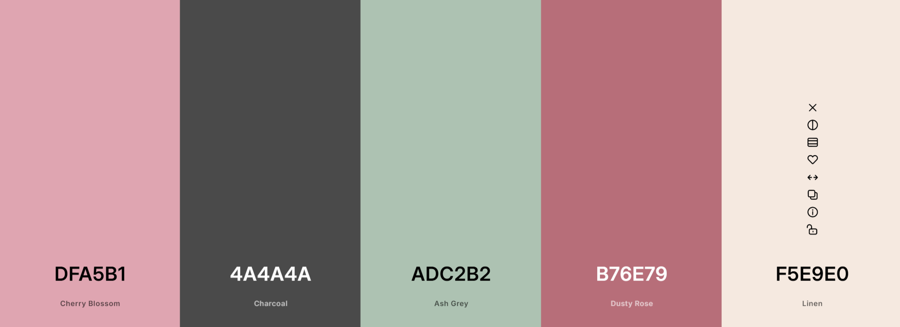

### Typography

Two fonts were selected from the **Google Fonts** font library:

- [Merriweather](https://fonts.google.com/specimen/Merriweather?selection.family=Lato|Oswald) for headings to convey warmth and trust
- [Source Sans 3](https://fonts.google.com/specimen/Source+Sans+3?selection.family=Lato|Oswald) for body text to ensure readability across devices

- [Font Awesome](https://fontawesome.com) icons were used throughout the site, such as the social media icons in the footer.

### Imagery

Black and white images are used for service related sections to maintain consistency and calmness.
Color images are reserved exclusively for the doula herself to create a personal connection and convey warmth and joy.

## Wireframes

To follow best practice, wireframes were developed for mobile, tablet, and desktop sizes.
I've used [tldraw](https://www.tldraw.com/) to design my site wireframes.

## User Stories

| Target | Expectation | Outcome |
| --- | --- | --- |
| As a pregnant or trying-to-conceive person in Berlin | I want to quickly understand what a full-spectrum doula offers | so I can decide if this support fits my needs. |
| As an English-speaking expat | I want the site to feel designed for internationals | so I feel supported navigating pregnancy in Germany. |
| As a client at a specific pregnancy stage | I want services clearly separated by prenatal, birth, and postpartum care | so I can easily find what applies to me. |
| As someone experiencing fertility struggles or loss | I want counseling services presented with sensitivity | so I feel safe exploring this option. |
| As someone unfamiliar with German maternity care | I want to understand how doula support works alongside doctors and midwives | so I feel confident choosing this service. |
| As a pregnant woman | I want to learn about the doula’s philosophy and background | so I can feel trust before making contact. |
| As a ready-to-reach-out client | I want an easy, calming way to make contact | so reaching out doesn’t feel stressful. |
| As a pregnant person browsing the website on my mobile phone | I want to quickly find the information I'm looking for, using a clear and simple navigation | so that I feel supported and not overwhelmed while exploring the doula's services. |
| As a doula | I want visitors to clearly understand my personal story, values, and motivations for becoming a doula | so that they feel an emotional connection and trust me before reaching out.

## Responsiveness and Accessibility

The website was designed using a mobile-first approach which was developed with Bootstrap 5.

Accessibility considerations include:

- Clear navigation
- Readable font sizes
- Sufficient color contrast
- Visible form labels
- Distintive buttons and links

## Features

### Existing Features

| Feature | Notes | Screenshot |
| --- | --- | --- |
| Navbar | Featured on all four pages, the full responsive navigation bar includes links to the Home page, Services page, About Me page and Contact page and is identical in each page to allow for easy navigation. On the smallest screens, a burger icon is used to toggle the navbar so it doesn't take up too much space. This section will allow the user to easily navigate from page to page across all devices without having to revert back to the previous page via the "back" button. The navbar is also `fixed`, so it stays in view even if the user has scrolled to the bottom of the page. | 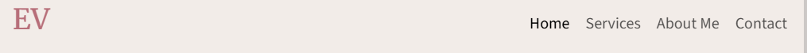 |
| Hero Image | The landing includes a greyscale photo with text-overlay to allow the user to see exactly what is offered and in which city. This section introduces the user to *Evita Varela*, it describes what she does and includes an empowering affirmation. | 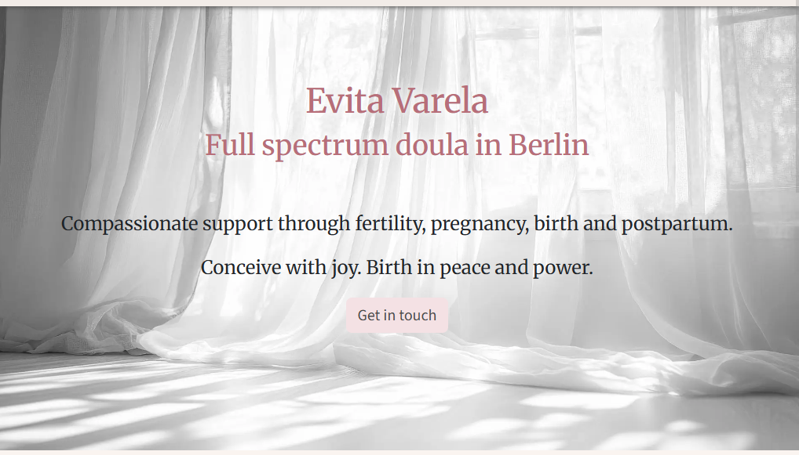 |
| Service Cards | The four service cards provide brief, concise information about what services are offered and each includes a Call to Action button that takes the user to the specific section of the services page where they can find detailed information. This should encourage the user to seek more information about the services. | 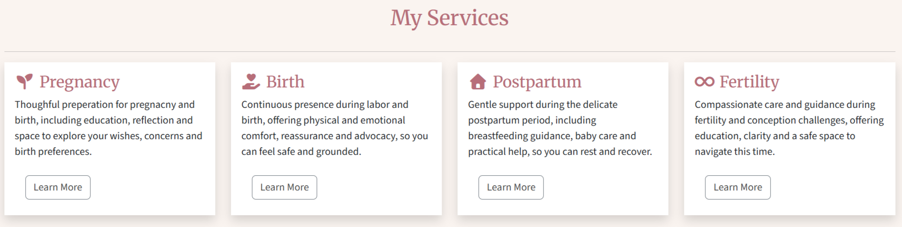 |
| About Me preview | This section will allow the user to see a picture of the doula to inspire trust. A short text about her is also provided with a soft Call to Action to find out more about her in the form of a button. | 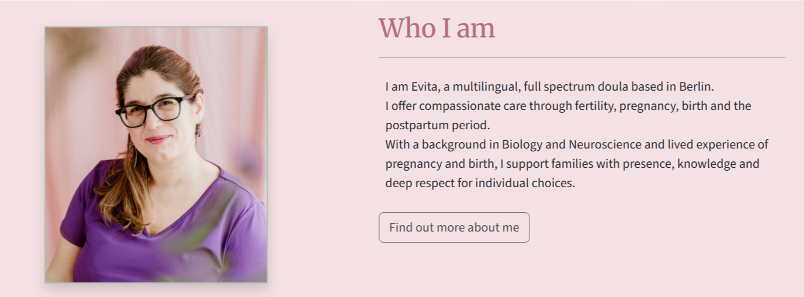 |
| Featured In Section| This section includes links to two relevant websites in which *Evita Varela* has been featured. The links will open in a new tab to allow easy navigation for the user. This is valuable to the user, as it provides credibility and builds trust towards the doula and her ability. | 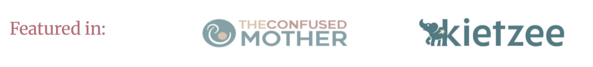 |
| Footer | The footer includes links to the social media sites for *Evita Varela*. The links will open in a new tab to allow easy navigation for the user. The footer is valuable to the user, as it encourages them to keep connected via social media. |  |
| Services | The services page provides detailed informaion about the four different services provided and type of support the user can receive from the doula, including duration and benefits. Sublte CTAs are included below each service section. It also lists the packages offered, which include combinations of the adove mentioned services. | 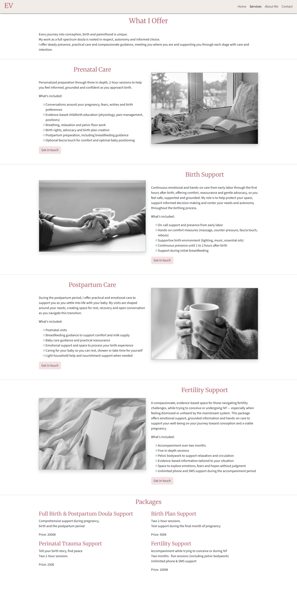 |
| About Me | The About Me page icludes a second, lagrer portrait of the *Evita Varela*, as well as a long text written in the first person, describing her journey to becoming a doula, her values, beliefs and motivation. Underneath a section about her education and credentials, training and language skills is included, to deepen the trust in her experience. At the and of the page the Featured In section is icluded once more, in order to call attention to her contributions in repsected websites regarding parenting and motherhood. | 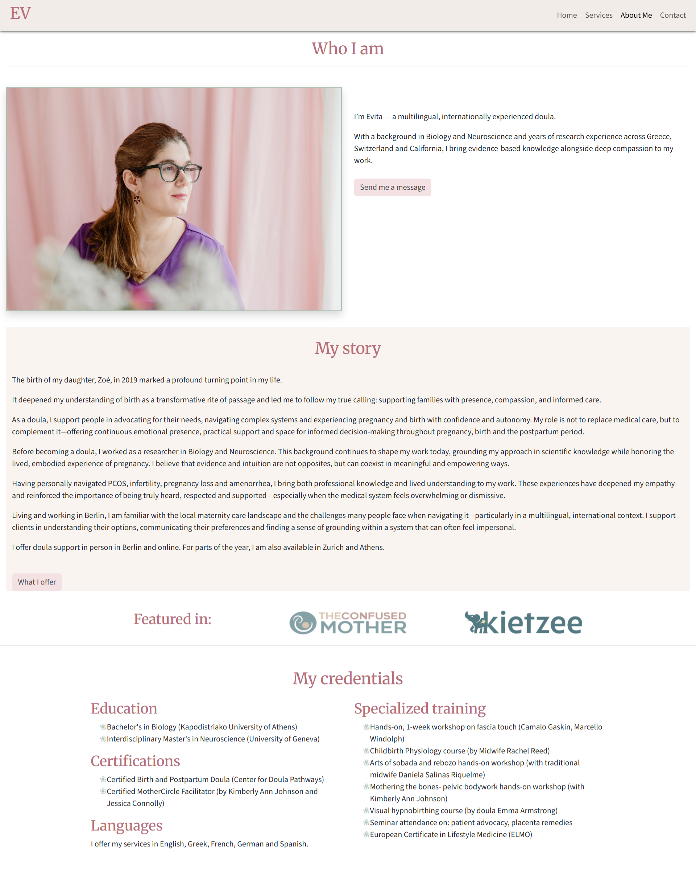 |
| Contact | This page will allow the user to contact *Evita Varela* and start their cooperation with her. A short reassuring text above the contact form aims to reduce aprehension and possible doubt about reaching out, since this a very personal service at a vulnerable time. The user will be able specify what type of support they are looking for, but also given the option to not specify, in case they feel uncertain or are dealing with a more comlicated situation,. The user will be asked to submit their name and email address. | 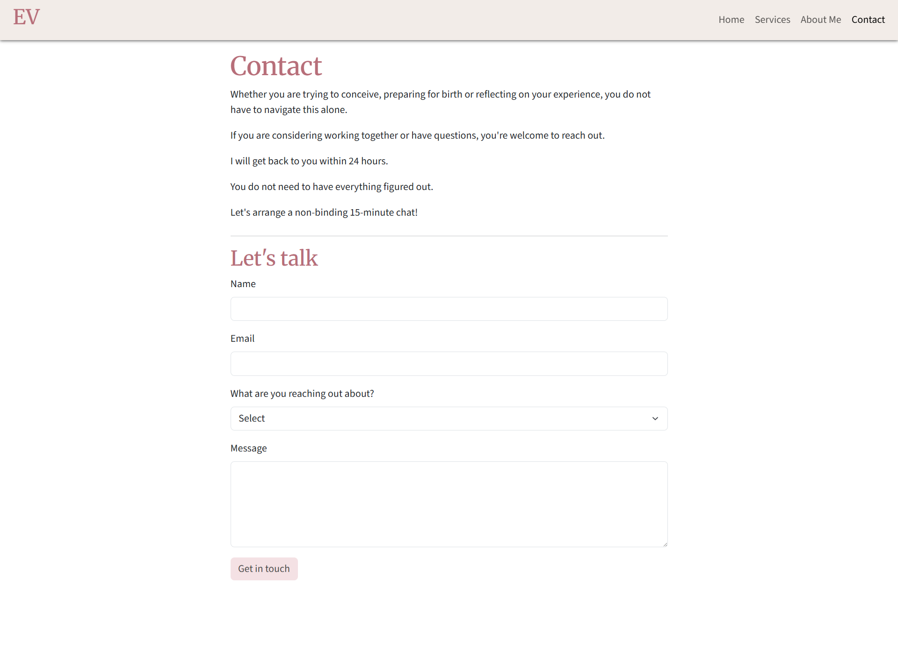 |
| Success | The confirmation page will give the illusion that the contact form was submitted successfully and a message was sent to *Evita Varela*. Due to the lack of a database or email system so far, this is a fake confirmation page. | 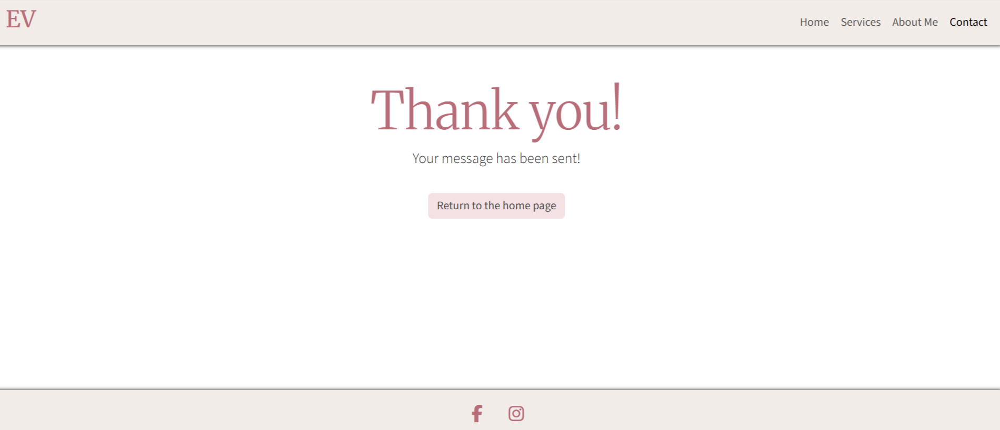 |
| 404 | The 404 error page will indicate when a user has somehow landed on a page that ins't ready to be born yet. This replaces the default GitHub Pages 404 page, and ties-in with the look and feel of the *Evita Varela* site by using the standard navbar, without the links, a link to the Home page in the form of a button and the footer. |  |

### Future Features

- **Testimonials Section**: *Evita varela* whishes to showcase testimonials from previous, satisfied clients clearly, so potential clients feel reassured and confident in their choice and understand her approach before contacting her.
- **Translate the website into Greek and French**: The doula wishes her website to be available in all three languages, in which she is fluent, in oder to be able to reach more international families and expats and increase her clientbase.
- **Blog**: Creating the layout and structure for a blog and linking it to the Home page or navbar, will allow the doula to showcase her work in writing articles and delving deeper into issues regarding pregnacy, birth and parenting. This will provide more information to the users, urging them to trust doula and hire her.
- **FAQs Section**: Adding a FAQs section accessible from main navigation or footer, where practical questions, regarding the healthcare system, burocracy and other specific subjects, can be answered directly, will elevate the profile of the website. It will allow the users to find answers to common questions on the website easily and quickly, so that the doula spends less time responding to repetitive emails and messages. 
- **Connect the contact form to the doula's email**: Making the contact form functional, will ensure that the website can be used by *Evita Varela* as her actual business website.

### User Stories for the future features

| Target | Expectation | Outcome |
| --- | --- | --- |
| As someone unfamiliar with German maternity care | I want to understand how doula support works alongside doctors and midwives | so I feel confident choosing this service. |
| As an expectant parent | I want to quickly understand bureaucratic and insurance-related aspects of hiring a doula in Germany | so that I can make an informed decision without stress. |
| As a potential client | I want to know at which stages of pregnancy, birth and postpartum a doula can support me | so I can decide if and when to book her services. |
| As a client considering support | I want to read detailed testimonials from other parents | so that I feel reassured and confident in my choice. |
| As a doula | I want clients to find answers to common questions on my website | so that I spend less time responding to repetitive emails and messages. |
| As a doula working in Berlin | I want my website available in English, Greek, and French, the languages in which I am fluent | so I can reach international families and expats. |
| As a doula | I want to showcase testimonials and values clearly | so potential clients understand my approach before contacting me. |
| As a business owner | concerned with connectivity and business growth | I want users reading FAQs or testimonials to be guided to contact me, so that interest turns into inquiries. |
| As a business owner | I want the site structure to support adding content later | so the site can grow without redesign. |

## Tools & Technologies

| Tool / Tech | Use |
| --- | --- |
|  | Generate README and TESTING templates. |
|  | Version control. (`git add`, `git commit`, `git push`) |
|  | Secure online code storage. |
|  | Local IDE for development. |
|  | Hosting the deployed front-end site. |
|  | Front-end CSS framework for modern responsiveness and pre-built components. |
|  | Icons. |
|  | Help debug, troubleshoot, and explain things. |
|  | Tutorials/Reference Guide |
|  | Troubleshooting and Debugging |
|  | Creating wireframes. |
|  | Generating the favicon. |
| [Techsini](https://techsini.com/multi-mockup/) | Generating the Mockups |
| [Autoprefixer](https://autoprefixer.github.io/) | Adding prefixes to CSS for all browsers. |
| [coolors.co](https://coolors.co/dfa5b1-4a4a4a-adc2b2-b76e79-f5e9e0) | Creating the color palette. |
| [Geeks for Geeks](https://www.geeksforgeeks.org/) | Tutorials |
| [CSS Tricks](https://css-tricks.com/) | Tutorials and Troubleshooting |
| [Josh W. Comeau](https://www.joshwcomeau.com/) | CSS Tutorials |
| [Nielsen Norman Group](https://www.nngroup.com/) | UX Design |
| [LanguageTool](https://languagetool.org/) | Grammar and Spell Check |

## Agile Development Process

### GitHub Projects

[GitHub Projects](https://www.github.com/angela64711/first-milestone-project/projects) served as an Agile tool for this project. Through it, EPICs, User Stories, issues/bugs, and Milestone tasks were planned, then subsequently tracked on a regular basis using the Kanban project board.

The project will be expanded in the future, by adding features according to the items remaining in the backlog of the Github Project Board.
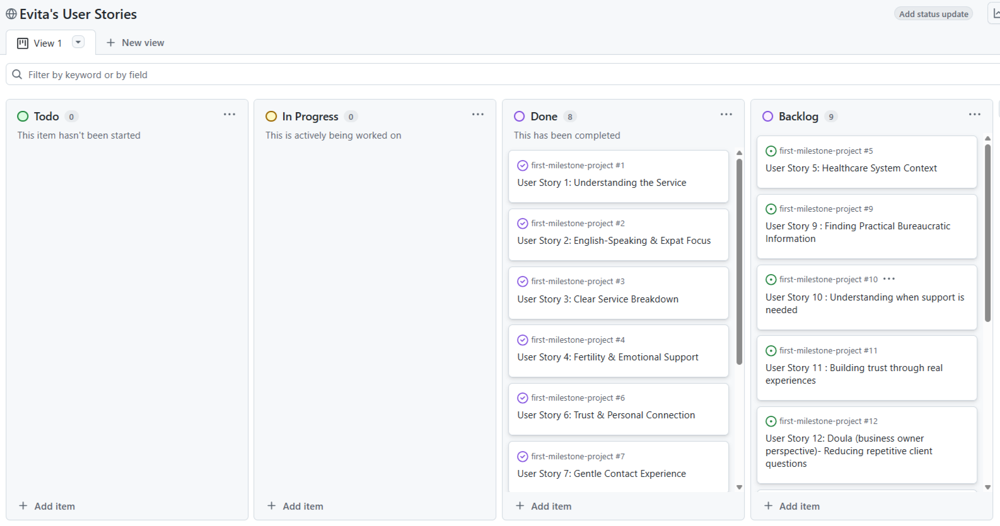

### GitHub Issues

[GitHub Issues](https://www.github.com/angela64711/first-milestone-project/issues) served as an another Agile tool. There, I managed my User Stories and Milestone tasks, and tracked any issues/bugs.

| Link | Screenshot |
| --- | --- |
|  |  |
|  |  |

### MoSCoW Prioritization

I've decomposed my Epics into User Stories for prioritizing and implementing them. Using this approach, I was able to apply "MoSCoW" prioritization and labels to my User Stories within the Issues tab.

- **Must Have**: guaranteed to be delivered - required to Pass the project (*max ~60% of stories*)
- **Should Have**: adds significant value, but not vital (*~20% of stories*)
- **Could Have**: has small impact if left out (*the rest ~20% of stories*)
- **Won't Have**: not a priority for this iteration - future features

## Testing

> For all testing, please refer to the [TESTING.md](TESTING.md) file.

## Deployment

### GitHub Pages

The site was deployed to GitHub Pages. The steps to deploy are as follows:

- In the [GitHub repository](https://www.github.com/angela64711/first-milestone-project), navigate to the "Settings" tab.
- In Settings, click on the "Pages" link from the menu on the left.
- From the "Build and deployment" section, click the drop-down called "Branch", and select the **main** branch, then click "Save".
- The page will be automatically refreshed with a detailed message display to indicate the successful deployment.
- Allow up to 5 minutes for the site to fully deploy.

The live link can be found on [GitHub Pages](https://angela64711.github.io/first-milestone-project).

### Local Development

This project can be cloned or forked in order to make a local copy on your own system.

#### Cloning

You can clone the repository by following these steps:

1. Go to the [GitHub repository](https://www.github.com/angela64711/first-milestone-project).
2. Locate and click on the green "Code" button at the very top, above the commits and files.
3. Select whether you prefer to clone using "HTTPS", "SSH", or "GitHub CLI", and click the "copy" button to copy the URL to your clipboard.
4. Open "Git Bash" or "Terminal".
5. Change the current working directory to the location where you want the cloned directory.
6. In your IDE Terminal, type the following command to clone the repository:
	- `git clone https://www.github.com/angela64711/first-milestone-project.git`
7. Press "Enter" to create your local clone.

Alternatively, if using Ona (formerly Gitpod), you can click below to create your own workspace using this repository.

**Please Note**: in order to directly open the project in Ona (Gitpod), you should have the browser extension installed. A tutorial on how to do that can be found [here](https://www.gitpod.io/docs/configure/user-settings/browser-extension).

#### Forking

By forking the GitHub Repository, you make a copy of the original repository on our GitHub account to view and/or make changes without affecting the original owner's repository. You can fork this repository by using the following steps:

1. Log in to GitHub and locate the [GitHub Repository](https://www.github.com/angela64711/first-milestone-project).
2. At the top of the Repository, just below the "Settings" button on the menu, locate and click the "Fork" Button.
3. Once clicked, you should now have a copy of the original repository in your own GitHub account!

### Local VS Deployment

There are no remaining major differences between the local version when compared to the deployed version online.

## Credits

### Content

| Source | Notes |
| --- | --- |
| [Markdown Builder](https://markdown.2bn.dev) | Help generating Markdown files |
| [Boardwalk Games](https://codeinstitute.net) | Code Institute walkthrough project inspiration |
| [Rosie Resumé](https://codeinstitute.net) | Code Institute walkthrough project inspiration |
| [Bootstrap](https://getbootstrap.com) | Various components / responsive front-end framework |
| [ChatGPT](https://chatgpt.com) | Help with code logic and explanations |

### Media

- Images
    - [Vecteezy](https://www.vecteezy.com/)
    - [Canva](https://www.canva.com/photos/free/)
    - The two portraits of Evita Varela were provided by herself for use in this project.

- Image Resizing and Compression
    - [Squoosh](https://squoosh.app/)
    - [I love IMG](https://www.iloveimg.com/)

All the images, apart from the two portraits, were found on Vecteezy and I was allowed to use them, provided I give attributions. 
The Prenatal Section Image was found on Canva and provided to me by Evita Varela, through her Pro account.
Below I list the exact attributions.

| Source | Notes |
| --- | --- |
| [favicon.io](https://favicon.io) | Generating the favicon |
| [Font Awesome](https://fontawesome.com) | Icons used throughout the site |
| [Vecteezy image by Oleg Gapeenko](https://www.vecteezy.com/free-photos/sunlight) | Hero image |
| [Vecteezy Image by pana design](https://www.vecteezy.com/photo/53252934-close-up-mockup-of-woman-hands-holding-a-blank-white-book-ideal-for-book-cover-design-branding-and-product-display-minimalist-and-cozy-scene) | Infertility support section |
| [Vecteezy image by Divine123 victory](https://www.vecteezy.com/photo/74180253-human-hands-gently-holding-a-warm-white-ceramic-mug-evoking-feelings-of-comfort-and-relaxation-indoors) | Postpartum Support section |
| [Vecteezy image by Tatyana Makarova](https://www.vecteezy.com/photo/73750975-two-people-holding-hands-across-table-with-coffee) | Birth Support section |
| [Canva image by TrueCreatives](https://www.canva.com/photos/MAG3_ny03qg-cozy-winter-window-seat-with-book) | Prenatal Support section |

### Acknowledgements

- I would like to thank my Code Institute mentor, [Tim Nelson](https://www.github.com/TravelTimN) for the support throughout the development of this project. His patience and insights were invaluable.
- I would like to thank the [Code Institute](https://codeinstitute.net) Tutor Team for their assistance with troubleshooting and debugging some project issues.
- I would like to thank the [Code Institute Discord community](https://discord-portal.codeinstitute.net) for the moral support; it kept me going during periods of self doubt and impostor syndrome.
- I would like to thank my husband, for believing in me and allowing me to make this transition into software development, by taking care of our children and out home whenever I needed help.
- I would like to thank my sister, for supporting me, encouraging me, listening to me in times of joy and frustration and helping me with childcare.
- I would like to thank my children, who did their absolut best, trying to be quiet and let mom work.
- I would like to thank Evita Varela for trusting me to build this website for her and for working with me to enrich and adjust the content from her current website.

